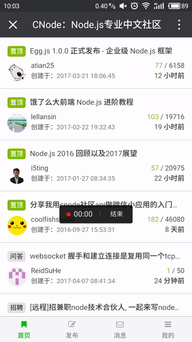
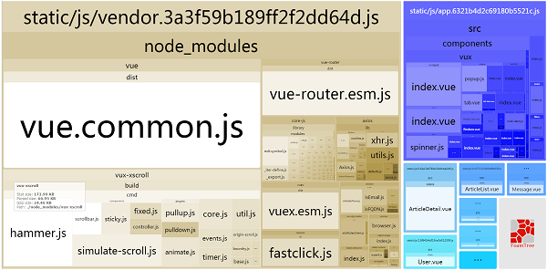

## Vue2版CNode社区WebApp

> 假若本项目能给到你一点点帮助，求Star！



在线地址：[http://cnode.ruanyq.cn/](http://cnode.ruanyq.cn/)

扫码二维码体验更佳（**推荐**）


### 满大街的重写CNode，这个有什么亮点？

- 比较接近原生APP体验
- 流畅的加载过渡效果
- 舒服细腻的UI样式布局
- 合理的列表渲染优化

### 最后
- 感谢[Cnodejs.org](https://cnodejs.org/)社区提供的API
- 感谢[Vue](https://github.com/vuejs/vue)提供无敌好用的渐进式JavaScript 框架
- 感谢[Vux](https://github.com/airyland/vux)提供无敌好用的组件库

### 使用方法
``` bash
# install dependencies
npm install

# serve with hot reload at localhost:8080
npm run dev

# build for production with minification
npm run build
```

### 代码体积可视化
在执行npm run build后，可查看本项目代码体积所占的大小以及比例。


